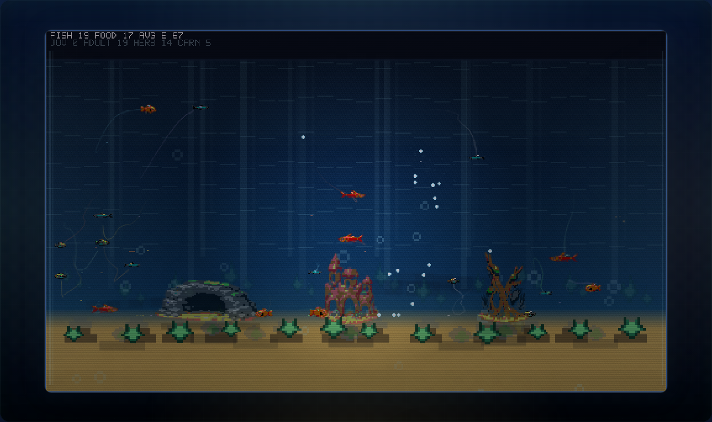

# Fishtank Ecology (VGA)

Fishtank Ecology is a browser-local emergent behavior observatory. It runs a bounded aquarium simulation with autonomous fish, deterministic seeds, habitat formations, current fields, resource pressure, and inspection tools for watching local rules turn into visible patterns.

The latest tagged release is recorded in [VERSION](./VERSION) and [CHANGELOG.md](./CHANGELOG.md). In-progress work for the next release stays under `Unreleased` in the changelog and [docs/roadmap.md](./docs/roadmap.md).



## Quick Start

```bash
python3 -m http.server 8000
```

Open:

- `http://localhost:8000`
- `http://localhost:8000/seed-audit.html`

With the server running, a minimal sanity pass is:

```bash
node --check game.js
curl -I http://127.0.0.1:8000/index.html
curl -I http://127.0.0.1:8000/seed-audit.html
python3 scripts/check_seed_audit.py
python3 scripts/check_replay_stress.py
```

To build the deployable static artifact:

```bash
bash scripts/build_static_site.sh
```

## Highlights

- autonomous grazers, shoalers, opportunists, and hunters with local sensing and simple intent rules
- deterministic seeded tanks with bottom-mounted formations, wake zones, and current variation
- juvenile and adult life stages, food competition, predation, reproduction, and disturbances
- observatory UI with focus mode, fish inspector, named fish subjects, an in-tank subject card, story counters, watch feed, lineage highlighting, event timeline, scenario lab controls, replay bookmarks, and seed audit tools
- Asset Forge-backed fish and habitat art with fallback rendering in `game.js`

## Docs

Simulation and usage:

- [docs/observatory.md](./docs/observatory.md): controls, overlays, inspector behavior, and what to watch
- [docs/simulation.md](./docs/simulation.md): ecology model, seeds, runtime parameters, and audit workflow
- [docs/assets.md](./docs/assets.md): Asset Forge sceneplans, generated assets, and fallback behavior
- [docs/deployment.md](./docs/deployment.md): static hosting, hardening posture, and GitHub Pages deployment
- [docs/roadmap.md](./docs/roadmap.md): planned version milestones, current quality notes, and the next major product direction

Repository workflow:

- [CONTRIBUTING.md](./CONTRIBUTING.md): branch, commit, PR, and verification expectations
- [RELEASING.md](./RELEASING.md): SemVer policy, tagging flow, and release metadata contract
- [AGENTS.md](./AGENTS.md): agent operating rules and release-response requirements
- [CHANGELOG.md](./CHANGELOG.md): release history
- [LICENSE](./LICENSE): MIT license
- [VERSION](./VERSION): current SemVer value

Tracked screenshots live under [docs/screenshots](./docs/screenshots). Release policy, versioning, and release-note format live in [RELEASING.md](./RELEASING.md).
